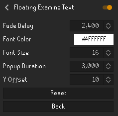
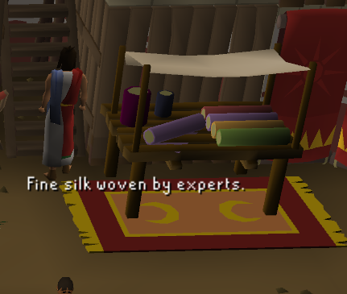
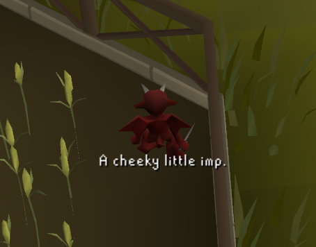
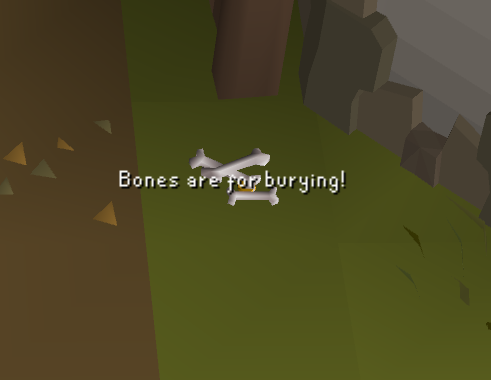

# Floating Examine Text
Shows examine text directly on examined objects/NPCs instead of the chatbox.

## Features
- Floating examine popup
- Configurable display behaviour
- Supports scenery objects, NPCs and items on ground

## Configuration

- Fade delay - determines after how many miliseconds the fade should start, defaults to 2400 (4 game ticks). Set it the same as popup duration for no fade.
- Font color - determines the color of the text
- Font size - determines the size of the text
- Popup duration - determines the total rendertime of each examine popup in miliseconds. Defaults to 3000 (5 game ticks)
- Y Offset - determines the vertical offset of the text from the center of the item examined

## Screenshots

## Change Log

### Version 1.0.0
- Added core functionality:
- Examine text on objects
- Examine text on NPCs
- Examine text on ground items